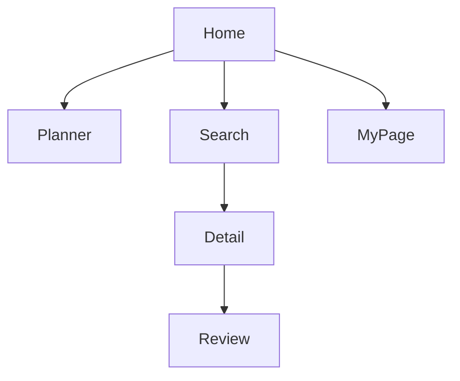

# 🚶‍♂️ 뚜벅(ddubuk): 뚜벅이를 위한 맞춤형 여행 플래너

> **"걷기 괜찮은가? 계단은 많은가?"**  
> 자차 없이 이동하는 당신을 위해, AI가 설계하는 **도보 + 대중교통 최적화 동선 서비스**

<br />

<div align="center">


</div>

---

## 🌟 개요

기존의 여행 앱들은 차량 이동을 전제로 경로를 제공합니다.  
**뚜벅(ddubuk)**은 대중교통과 도보를 이용하는 여행자들을 위해

- 역세권 장소
- 보행 환경 리뷰
- AI 동선 최적화

기능을 제공하여 **체력 소모를 줄이고 효율적인 여행**을 돕는 서비스입니다.

---

## ✨ 주요 기능

- 🤖 **AI Course**  
  Gemini AI 기반 맞춤형 여행 코스 추천

- 📍 **Smart Search**  
  역세권 판별 + 도보 중심 필터링

- 🗺️ **Interactive Maps**  
  카카오 맵 기반 실시간 동선 시각화 + DnD 타임라인

- ✍️ **True Review**  
  경사도, 계단 등 보행 환경 중심 리뷰 시스템

---

## 🛠 Tech Stack

### Frontend

<p>
  
  
  
  
</p>

### Backend / Infra

<p>
  
  
</p>

### AI & API

<p>
  
  
</p>

---

## 📂 Project Structure

```bash
src/
├── app/                # Next.js App Router
├── components/
│   ├── common/         # 공통 UI
│   ├── layout/         # 레이아웃
│   ├── display/        # 카드/리스트 UI
│   └── domain/         # 기능별 컴포넌트
├── store/              # Zustand 상태 관리
├── utils/              # 로직
└── lib/                # 설정 및 데이터
```

---

## 🧭 1. 프로젝트 목적 (Purpose)

### "차 중심의 여행에서 보행자 중심의 여행으로"

뚜벅(ddubuk)은 자차 없이 이동하는 사용자들을 위해  
현실적인 이동 경험을 기반으로 여행을 설계하는 서비스입니다.

- 체력 소모 최소화  
  보행 환경(경사, 계단 등)을 고려한 데이터 제공

- 이동 효율 극대화  
  AI 기반 동선 최적화

- 접근성 강화  
  역세권 중심 데이터 제공

---

## 🚀 2. 주요 기능 상세

### ① AI 지능형 일정 설계

- Gemini AI 기반 코스 추천  
- 이동 거리 최소화 동선 최적화  

---

### ② 인터랙티브 타임라인

- Drag & Drop 일정 편집  
- 이동 시간 / 비용 실시간 반영  
- 카카오맵 길찾기 연동  

---

### ③ 장소 탐색

- 역세권 자동 판별  
- 카테고리 필터링  
- 카드 UI 기반 탐색  

---

### ④ 리뷰 시스템

- 경사도 / 계단 / 그늘 평가  
- 이동 경로 시각화  

---

### ⑤ 마이페이지

- 일정 저장 및 관리  
- 북마크 기능  
- 활동 요약  

---

## 🏗️ 정보 구조도 (IA)




---

## 🌟 차별화 포인트

- 🚶 **사람 중심 이동 데이터**  
  차량 기준이 아닌 실제 도보 피로도 기반

- 🤖 **AI 기반 완성형 일정 제공**  
  장소 + 시간 + 이동수단까지 포함된 코스

- 💬 **보행 환경 리뷰 시스템**  
  경사도, 계단 등 실제 체감 정보 제공

- 💾 **여행 데이터 자산화**  
  저장, 재사용, 공유 가능한 여행 데이터

---

## 🚀 기대 효과

- 여행 계획 시간 단축  
- 이동 스트레스 감소  
- 체력 소모 예측 가능  
- 개인화된 여행 경험 제공  

---

## 📌 향후 확장

- 공공데이터 연계 (혼잡도, 물품보관함 등)  
- 동행 / 택시 동승 매칭 기능  
- 사용자 취향 기반 AI 추천 고도화  

---

## 📦 설치 방법

```bash
git clone https://github.com/your-repo.git  
cd your-repo  
npm install  
npm run dev  
```
___

## 👨‍💻 팀원

<table>
<tr>

<td align="center">
<a href="https://github.com/kjh3165">

<br />
<b>김정환</b>
</a>
<br />
FE/BE
</td>

<td align="center">
<a href="https://github.com/HeungJunBag">

<br />
<b>박흥준</b>
</a>
<br />
FE/BE
</td>

<td align="center">
<a href="https://github.com/SHINJAEHEE-DEV">

<br />
<b>신재희</b>
</a>
<br />
FE/BE
</td>

<td align="center">
<a href="https://github.com/cule1903">

<br />
<b>정민준</b>
</a>
<br />
FE/BE
</td>

<td align="center">
<a href="https://github.com/cwc5979">

<br />
<b>최원철</b>
</a>
<br />
FE/BE
</td>

</tr>
</table>

---

## 📄 라이선스

This project is licensed under the MIT License.

---

<div align="center">

### 🚶‍♂️ 뚜벅이는 덜 힘들게, 여행은 더 알차게

</div>

<br />

<div align="center">


</div>
